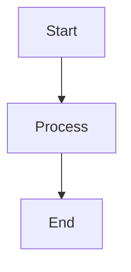

# Mermaid Charts

Create diagrams and visualizations using Mermaid.js text-based syntax. Mermaid renders text definitions into dynamic diagrams, making it ideal for documentation, technical specifications, and presentations.

## Quick Reference

### Most Common Diagrams

**Flowchart** - Process flows, decision trees, workflows
```
flowchart TD
    A[Start] --> B{Decision?}
    B -->|Yes| C[Action]
    B -->|No| D[Alternative]
```

**Sequence Diagram** - API flows, user interactions, message passing
```
sequenceDiagram
    Alice->>Bob: Request
    Bob-->>Alice: Response
```

**Class Diagram** - Object models, database schemas, system design
```
classDiagram
    Animal <|-- Dog
    Animal : +eat()
    Dog : +bark()
```

**State Diagram** - State machines, lifecycle flows
```
stateDiagram-v2
    [*] --> Idle
    Idle --> Active : trigger
    Active --> [*]
```

**ER Diagram** - Database relationships
```
erDiagram
    CUSTOMER ||--o{ ORDER : places
    ORDER ||--|{ ITEM : contains
```

**Gantt Chart** - Project timelines, task planning
```
gantt
    title Project Plan
    dateFormat YYYY-MM-DD
    section Phase 1
    Task 1 :a1, 2024-01-01, 30d
    Task 2 :after a1, 20d
```

## Detailed References

For comprehensive syntax, patterns, and examples:

- **[flowcharts.md](references/flowcharts.md)** - Node shapes, arrows, styling, subgraphs, decision trees
- **[sequence.md](references/sequence.md)** - Participants, messages, loops, alternatives, activation
- **[class.md](references/class.md)** - Classes, relationships, visibility, generics, patterns
- **[other-diagrams.md](references/other-diagrams.md)** - State, ER, Gantt, pie, git, mindmap, timeline, quadrant, XY, block, Sankey

## General Syntax Rules

### Basic Structure
All diagrams start with a type declaration followed by content:
```
[diagramType] [orientation]
    [content]
```

### Comments
Use `%%` for comments (ignored by parser):
```
%% This is a comment
flowchart TD
    A --> B  %% Inline comment
```

### Styling

**Inline styles:**
```
style NodeA fill:#f9f,stroke:#333,stroke-width:4px
```

**CSS classes:**
```
classDef className fill:#ff0,stroke:#000
class NodeA,NodeB className
```

**Shorthand:**
```
NodeA:::className --> NodeB
```

### Theme Variables
Common CSS variables for customization:
- `--mermaid-font-family`
- Colors: `--primary-color`, `--secondary-color`, `--background-color`
- Text: `--text-color`, `--label-color`

## Best Practices

1. **Start simple** - Add complexity incrementally
2. **Use meaningful names** - Clear node/participant IDs
3. **Group related items** - Use subgraphs or sections
4. **Add labels** - Make relationships explicit
5. **Test incrementally** - Verify syntax as you build
6. **Avoid special keywords** - Don't use "end" (lowercase) as node text
7. **Quote special characters** - Use quotes for text with special chars

## Output Format

Generate Mermaid diagrams as markdown code blocks:

````markdown

````

## Common Use Cases

### System Architecture
Use flowcharts with subgraphs to show system components and data flow.

### API Documentation
Use sequence diagrams to illustrate request/response patterns and error handling.

### Database Design
Use ER diagrams for entity relationships and class diagrams for ORM models.

### Project Planning
Use Gantt charts for timelines, dependencies, and milestones.

### State Management
Use state diagrams to document component or application state transitions.

### Decision Logic
Use flowcharts with diamond nodes to visualize business logic and branching.

## Integration Notes

Mermaid diagrams work in:
- GitHub/GitLab markdown (native support)
- Documentation sites (Docusaurus, VitePress, MkDocs)
- Notion, Confluence, Obsidian
- Jupyter notebooks
- VS Code (with extensions)
- Online: mermaid.live for testing

## Tips for Complex Diagrams

1. **Break into sections** - Use sections/subgraphs to organize
2. **Layer information** - Start with high-level, add detail progressively
3. **Use consistent naming** - Follow a naming convention
4. **Leverage references** - Read the detailed reference files for advanced syntax
5. **Test frequently** - Validate syntax with each addition

## Troubleshooting

- **Syntax errors** - Check for typos, missing quotes, or incorrect keywords
- **Layout issues** - Try different orientations (TD, LR, BT, RL)
- **Overlapping elements** - Use spacing, subgraphs, or reorder nodes
- **Special characters** - Wrap text in quotes: `A["Text with: special chars"]`
- **Keywords as text** - Capitalize or quote keywords like "end"
