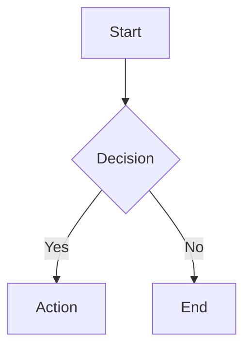
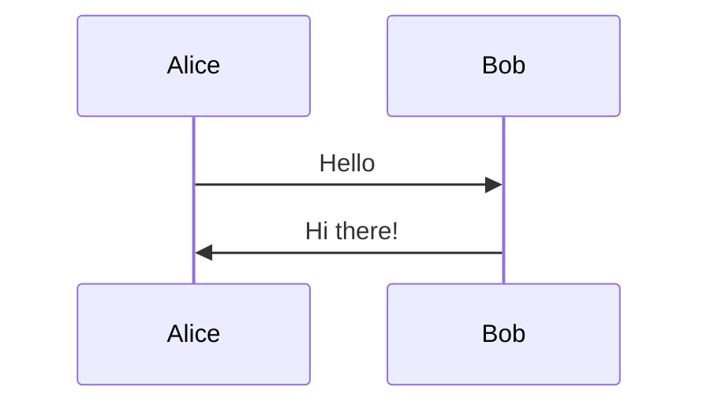
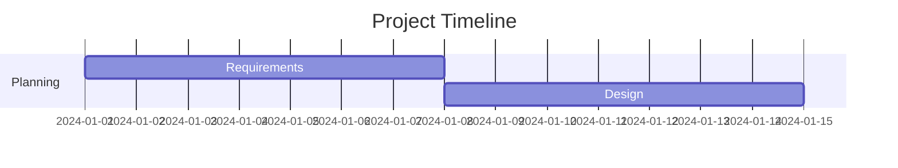
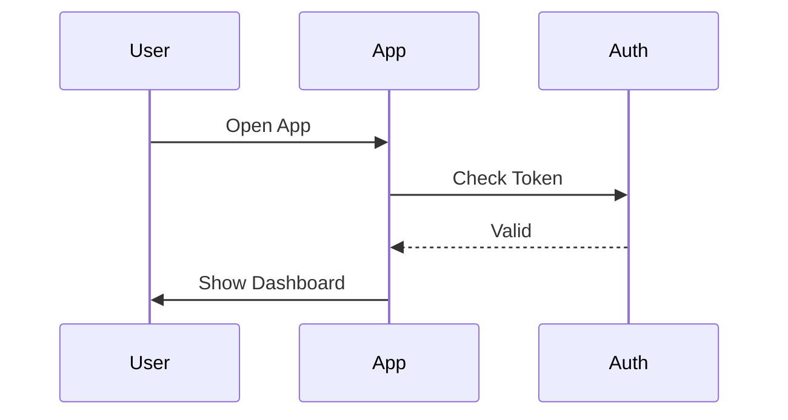

# Chart Auto-Detection Feature Guide

## 🎯 What Was Built

An automatic chart detection and rendering system that transforms markdown code blocks containing Mermaid or Vega-Lite definitions into interactive, theme-aware visualizations.

---

## 🚀 How to Test It

### Option 1: Demo Page (Recommended)
Visit the demo page to see it in action immediately:

```
http://localhost:3001/demo/charts/auto-detection
```

This page shows:
- ✅ Mermaid flowchart example
- ✅ Vega-Lite bar chart example
- ✅ Mixed content (multiple charts in one message)
- ✅ Plain text rendering (no charts)

### Option 2: AI Chat Demo
Visit the AI chat page and ask for charts:

```
http://localhost:3001/demo/ai
```

Try these prompts:
- "Create a mermaid flowchart showing a user login process"
- "Create a vega-lite bar chart showing quarterly sales"
- "Show me a sequence diagram for API authentication"

---

## 📝 How It Works

### The Flow

1. **User Message** → Contains markdown with code block:
   ````markdown
   ```mermaid
   flowchart TD
       A[Start] --> B[End]
   ```
   ````

2. **ChatMessage Component** → Passes content to `MessageContent`

3. **MessageContent Component** → Uses `react-markdown` to parse markdown
   - Detects `language-mermaid`, `language-vega`, or `language-vega-lite` classes
   - Triggers custom code renderer

4. **ChartContainer Component** → Renders the chart with:
   - Sanitized definition (removes problematic syntax)
   - Theme-aware styling
   - Toolbar (View Code, Download SVG/PNG)
   - Error handling

5. **Chart Rendering** → Delegates to existing components:
   - `MermaidChart` for diagrams
   - `VegaChart` for data visualizations

---

## 🎨 Supported Chart Types

### Mermaid Diagrams

All standard Mermaid diagram types work:

````markdown

````

````markdown

````

````markdown

````

### Vega-Lite Charts

````markdown
```vega-lite
{
  "$schema": "https://vega.github.io/schema/vega-lite/v5.json",
  "width": "container",
  "height": 300,
  "data": {
    "values": [
      {"category": "A", "value": 28},
      {"category": "B", "value": 55},
      {"category": "C", "value": 43}
    ]
  },
  "mark": "bar",
  "encoding": {
    "x": {"field": "category", "type": "nominal"},
    "y": {"field": "value", "type": "quantitative"}
  }
}
```
````

Or use the shorter `vega` language identifier:

````markdown
```vega
{ "mark": "bar", "data": {...}, "encoding": {...} }
```
````

---

## 🔧 Technical Implementation

### Key Components

1. **MessageContent** (`src/components/ai/MessageContent.tsx`)
   - Markdown renderer with custom code block detection
   - 100 lines of code
   - Uses `react-markdown` + `remark-gfm`

2. **ChartContainer** (`src/components/ai/ChartContainer.tsx`)
   - Chart wrapper with toolbar and error handling
   - 250 lines of code
   - Handles both Mermaid and Vega-Lite

3. **Utilities**
   - `chart-sanitization.ts` - Syntax cleaning and validation
   - `chart-download.ts` - SVG/PNG export for both types

### Modified Files

- **ChatMessage.tsx** - 4 lines changed (now uses MessageContent)
- **VegaChart.tsx** - Added `onViewReady` callback for downloads

---

## ✨ Features

### Automatic Features
- ✅ **Theme Integration** - Charts adapt to light/dark mode automatically
- ✅ **Error Handling** - User-friendly error messages for invalid syntax
- ✅ **Sanitization** - Removes problematic Mermaid syntax automatically
- ✅ **Responsive** - Charts scale to container width

### Interactive Features
- ✅ **View Code Toggle** - Show/hide the raw chart definition
- ✅ **Download Options** - SVG or PNG for both chart types via dropdown
- ✅ **Collapsible** - Code view is collapsible, chart always visible

### Markdown Support
- ✅ **Full GFM** - Tables, lists, links, bold, italic, etc.
- ✅ **Code Blocks** - Regular code blocks render normally
- ✅ **Mixed Content** - Text + multiple charts in one message

---

## 🎯 Usage in Real Applications

### In AI Chat
When the AI returns a response with a chart, it automatically renders:

**AI Response:**
```
Here's the authentication flow you requested:



This ensures secure user authentication.
```

**Result:** The flowchart renders automatically with a toolbar!

### In Static Content
You can use it anywhere you have markdown content:

```tsx
import { MessageContent } from "@/components/ai/MessageContent";

<MessageContent content={markdownString} />
```

---

## 🐛 Troubleshooting

### Charts Not Rendering?

**Check 1:** Is the dev server running?
```bash
npm run dev
```

**Check 2:** Is the code fence correct?
````markdown
# ✅ Correct
```mermaid
flowchart TD
```

# ❌ Wrong (missing language)
```
flowchart TD
```
````

**Check 3:** Open browser console for errors

### Vega-Lite Not Showing?

**Check 1:** Is the JSON valid?
- Use the Vega Editor to validate: https://vega.github.io/editor/

**Check 2:** Did you include required properties?
- Must have `mark`, `layer`, or composition (`concat`, `hconcat`, `vconcat`)
- Must have `data` with `values` array

**Check 3:** Is `width` set to `"container"`?
```json
{
  "width": "container",  // ← Required for responsive charts
  "height": 300
}
```

### Downloads Not Working?

**For Mermaid:**
- Ensure the chart has finished rendering (wait for SVG to appear)

**For Vega-Lite:**
- Ensure the chart loaded successfully
- Check browser console for errors

---

## 📚 Example Prompts for AI

Ask Claude or GPT to create charts using these prompts:

### Mermaid Examples
```
"Create a mermaid flowchart showing the user registration process with email verification"

"Show me a sequence diagram for a REST API authentication flow"

"Create a gantt chart for a 6-month software project with phases: Planning, Development, Testing, Deployment"

"Make a class diagram for a simple e-commerce system with User, Product, and Order classes"
```

### Vega-Lite Examples
```
"Create a vega-lite bar chart showing monthly revenue: Jan $45k, Feb $62k, Mar $58k, Apr $71k"

"Show me a line chart with temperature trends over the last week"

"Create a scatter plot showing the relationship between study hours and test scores"

"Make a stacked bar chart comparing sales by region and quarter"
```

---

## 🎨 Customization

### Chart Theming
All charts use CSS variables from `src/styles/tokens.css`:
- `--chart-1` through `--chart-5` for colors
- `--foreground` for text
- `--border` for borders
- `--background` for backgrounds

Charts automatically adapt when you switch themes!

### Toolbar Styling
Edit `ChartContainer.tsx` to customize:
- Button labels
- Icon styles
- Layout (currently: Icon + Title on left, buttons on right)

---

## 📁 File Structure

```
src/
├── components/
│   ├── ai/
│   │   ├── ChartContainer.tsx       # NEW - Chart wrapper with toolbar
│   │   ├── MessageContent.tsx       # NEW - Markdown renderer
│   │   └── ChatMessage.tsx          # MODIFIED - Uses MessageContent
│   └── charts/
│       ├── MermaidChart.tsx         # Existing - Used by ChartContainer
│       └── VegaChart.tsx            # MODIFIED - Added onViewReady
├── lib/utils/
│   ├── chart-sanitization.ts        # NEW - Validation utilities
│   └── chart-download.ts            # NEW - Export utilities
└── app/
    └── demo/charts/auto-detection/
        └── page.tsx                 # NEW - Demo page
```

---

## 🚀 Next Steps

1. **Test the demo page** at `/demo/charts/auto-detection`
2. **Try the AI chat** at `/demo/ai` and ask for charts
3. **Download a chart** using the toolbar dropdown
4. **Toggle code view** to see the raw definition
5. **Switch themes** to see automatic adaptation

---

## 📝 Notes

- Based on UserScript v0.24 patterns
- Fully TypeScript typed
- Zero breaking changes to existing functionality
- All styling uses CSS variables (theme-aware)
- Production-ready

---

**Need Help?**
- Check browser console for errors
- Visit `/demo/charts/auto-detection` for working examples
- Review the plan at `~/.claude/plans/hazy-wiggling-star.md`
